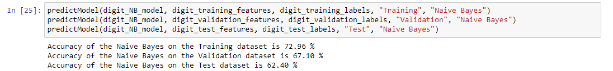
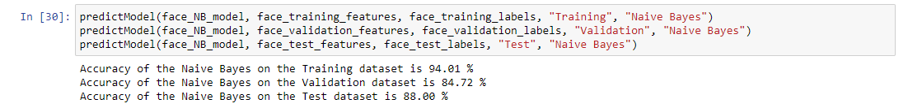
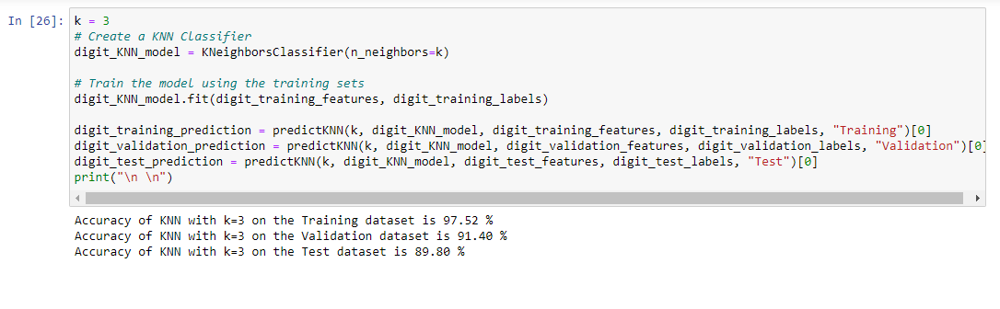
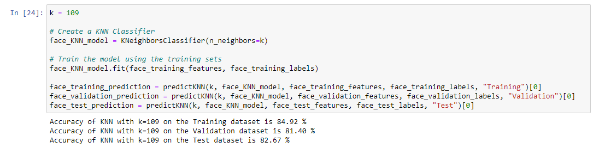

# Machine Learning Classifiers

## How to run:

1. Run through downloading the Jupyter notebook and the prerequisite libraries

## Naive Bayes Classifier

### Digit Dataset

### Face Dataset

## KNN (K Nearest Neighbors) Classifier

### Digit Dataset

### Face Dataset

