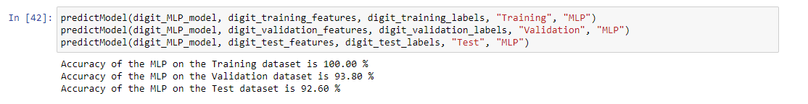
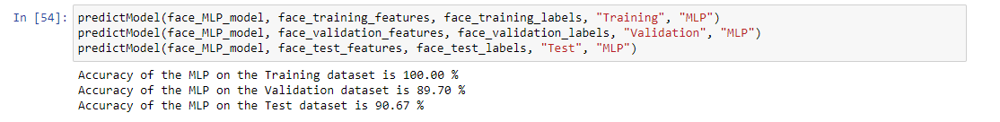
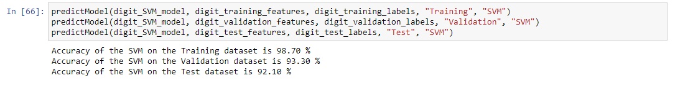
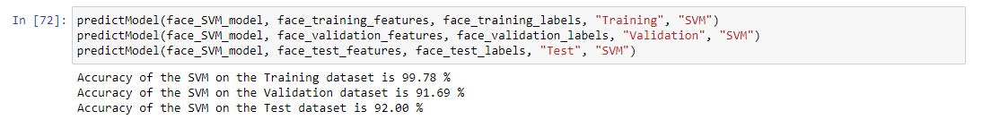
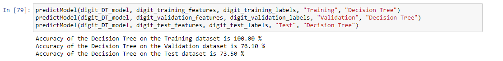
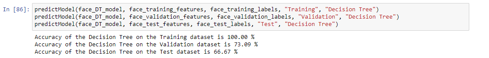

# Machine Learning Classifiers

This repository contains the implementation of Naive Bayes, KNN (K Nearest Neighbors), Multilayer perceptron (MLP), Support Vector Machine (SVM) and Decision Tree (DT) classifiers for the arabic numerals (digits) and faces datasets in ASCII.

## Naive Bayes Classifier

### Digit Dataset Results

### Face Dataset Results

## KNN (K Nearest Neighbors) Classifier

### Digit Dataset Results

### Face Dataset Results

## Multilayer perceptron (MLP) Classifier

### Digit Dataset Results

### Face Dataset Results

## Support Vector Machine (SVM) Classifier (Support Vector Classification)

### Digit Dataset Results

### Face Dataset Results

## Decision Tree (DT) Classifier

### Digit Dataset Results

### Face Dataset Results

